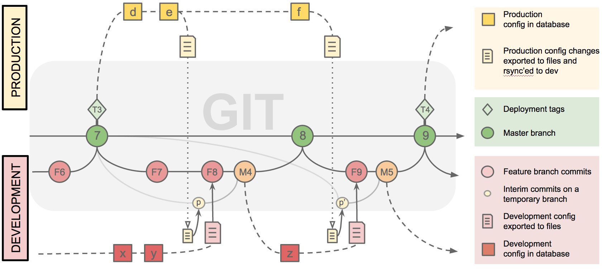

# Rsync Workflow



The diagram above shows the rsync workflow supported by Drush `config-merge`.  The rsync workflow is the best mode to use when working with Pantheon, or other systems where it is not possible to run git operations over ssh.  If you have full ssh shell access to the remote site, than you should consider using the  [git workflow](git_workflow.md) instead.

## Getting Started

It is recommended that you set up a free Pantheon development site to use for experimentation purposes, and then make a local copy of it as described in the [INSTALL](../INSTALL.md) document.  You may also use an existing site that you provide, if you wish.

## Example Scenario

Alice and Bob work together at a small web shop they started; Alice does all of the back-end coding and module development, while Bob handles the theming and site building.  They recently decided to use the Pantheon environment to manage their development workflow. They have been working on a website together there for a while, and they are now ready to deploy it to their client, Pat. Pat has read a few Drupal books, and is excited at its ability to create content and position blocks through the admin web interface.  Pat is very enthusiastic to do as much as possible without intervention from the web developers, so Alice and Bob make sure that the server is being backed up regularly, and that the content editor permissions are carefully configured, and let Pat go to work.

In the past, Alice and Bob might have been nervous to allow Pat to make changes on the production server; they usually used the [config_readonly module](https://www.drupal.org/project/config_readonly) to explicitly prevent this.  Pat really wanted to avoid having to contact Alice and Bob just to reposition a block, though, so they agreed that certain limited changes to configuration would be allowed on the production server for this project.

When Alice notices that Pat has made some changes to the production configuration, she can run Drush `config-merge` commands to fetch them.
```
$ drush @dev config-merge @live --temp --base=T3
```
Operationally, this command works about the same as it does in the git workflow; however, Drush does extra work to allow for the fact that git is not available on the remote system.  The adjusted sequence of operations now looks like this:

1. Drush will remotely run config-export on the production server to write the active configuration files to the filesystem.
2. Next, Drush uses rsync to copy all of the exported files to the local system.  These files are committed onto a working branch as commit (p).
3. Drush then runs config-export on the dev server, and commits the active configuration on the current feature branch as (F8).
4. git config-merge is then ran as usual to produce commit (M4).  The three-way diff tool will be brought up to resolve conflicts, if there are any.

When using the rsync mechanism, it is important to tell Drush the name of the tag that was used to deploy configuration to the production server.  In the example above, tag <T3> is provided, so the working branch that is created to hold the commit (p) is started from that point.  If Pat continues to make changes after Alice has merged in (M4), Alice can run the config-merge command again, still providing <T3> as the deploy tag.  Drush will then create a working branch for (p’).  The current configuration from the dev machine will be committed to (F9), and then git merge will merge the dev changes from [x], [y] and [z] with [d], [e] and [f] from the production changes [d], [e] and [f].  This means that Alice will see all of the conflicts already fixed in (M4), and will have to resolve them again.

If Alice forgets to provide the base commit, then Drush will create the working branch from the most recent commit from master that has been pushed to the central repository.  In the example above, (p’) would then branch from (8) instead of <T3>.  Note that commit (8) includes (F8), with the changes [x] and [y], but these changes do not appear in (p’).  Given these starting conditions, git will assume that [x] and [y] were explicitly removed in (p’), and these changes will disappear in (M5).  To avoid confusion and lost configuration changes, it is therefore very important to always provide the name of the deployed branch.
