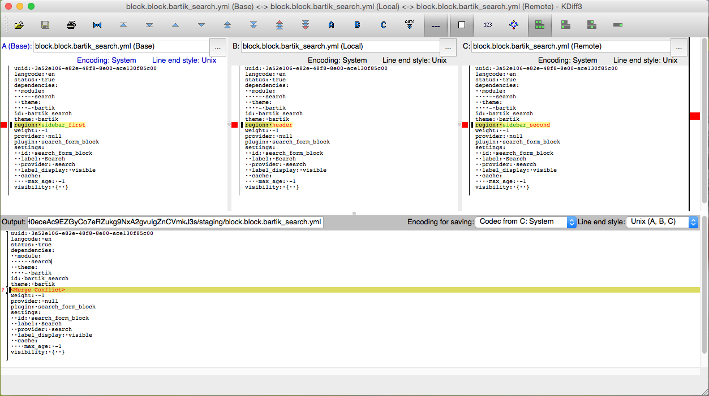
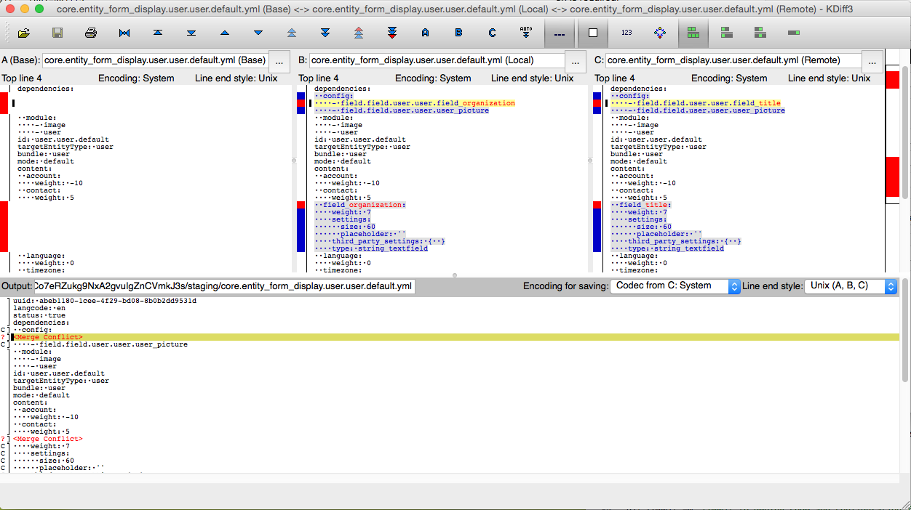
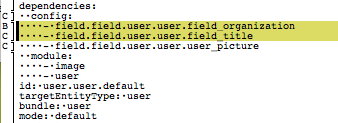
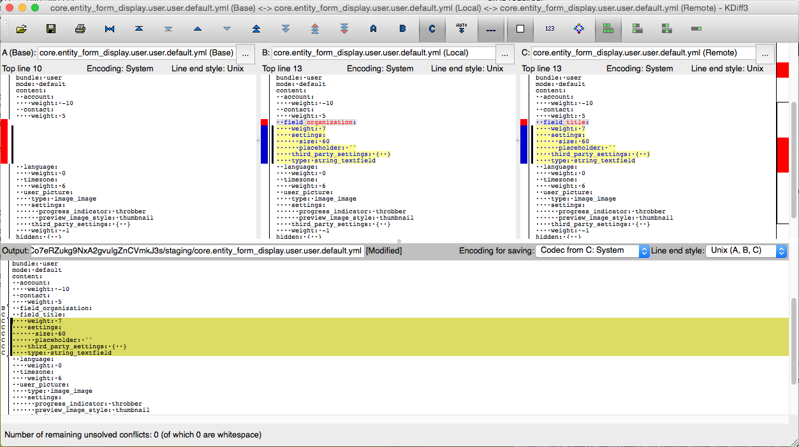
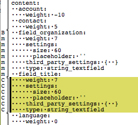

# Three-Way Merge

In most cases, git does a very good job at combining changes made to the same file by different commits.  Whenever possible, all changes are applied in a way that maintains the integrity of each commit.  Occasionally, though, two commits will make contradictory or irreconcilable changes to the same part of a file.  In these instances, git will include both of the changes, surrounded with annotations that tell the user where each one originated.

When this happens, it is possible for the user to use `git status` and `git diff` to find the conflicts, and then resolve them by hand with a text editor.  Many people use this workflow successfully; however, it is simpler and more convenient to use a three-way merge tool to display the conflicts side-by-side.

A three-way merge is so named because it considers three distinct revisions of each conflict:  

* The revision that came from our repository, called "local", or "ours".
* The revision that came from the other repository, called "remote", or "theirs".
* The original state of the text, prior to either change being applied.

All three of these revisions are shown together, side-by-side-by-side, and controls are provided to allow the user to select which changes to keep, and which to discard.  The user is also usually supplied with an editable fourth pane, where the final state of the file is shown, post-merge.  In some cases, the final desired state requires that the "ours" and "theirs" revisions be combined or reordered in some way.  In this event, the user may edit the text manually to fill in any gaps that the tool could not derive automatically.

## Simple example -- conflicting changes

The canonical example of a conflict is when the same line in the same file is changed in distinctly different ways in two different commits.  This is a true conflict.  There is no way for git to determine which commit contains the desired value; it could be one commit, or the other, or perhaps both lines should appear, in which case one of them must come first, and the other second.  Manual inspection and correction is required.

There are many possible ways that a conflict can be introduced; one hypothetical scenario is given below.

Alice and Bob receive a change request from their client in an email.  Pat wants to move the search block out of the left sidebar, but isn't sure whether it would look better in the right sidebar or in the header.  Alice sees the email on her smartphone when she happens to be near Pat's office, so she drops in to discuss the change.  They decide to put the block in the header, so Alice makes the change on her laptop and commits it.

Meanwhile, Bob also sees the email and decides that he'll just move the search block to the right sidebar, so that he can show it to Pat in their next client meeting.  He then commits the change, and deploys it on the staging server.

When Alice returns to the office, she reconnects to the Internet and runs `config-merge` to pick up Bob's latest changes.  Oh oh, there's a conflict!

It is clear to Alice from the diff what happens.  Since she knows that Pat prefers the search block in the header, she selects the change shown in the center panel labeled "B: block.block.bartik_search.yaml (Local)", by pressing the "B" button.  Since that was the only conflict that kdiff3 presented to her, she can save her change and close the kdiff3 dialog.  Drush `config-merge` will then ask her about the outcome of the three-way merge.  Since Alice was satisfied with the result, she tells `config-merge` to commit the changes and import the configuration onto her working site.  The next time her change is deployed to the staging server, the search block will move to the correct region. 

## Complex example -- overlapping changes

Sometimes, git simply isn't smart enough to figure out how to correctly merge together different overlapping changes.  Differing changes that contain similar sections are one kind of conflict that are particularly difficult for git to reconcile.  The example below describes one common scenario where this sort of conflict can arise.

Alice and Bob are both working on features involving user entities.  Bob needs to add a "title" to each user on the site.  He decides to add a text field to the user entity, so that users can enter anything that they want for their title.  At the same time, Alice is working on code to collate user lists based on an "organization" property taken from an external system.  Alice decides to add a text field to the user entity to cache this value.

The next time Alice runs `config-merge`, she will see a conflict between her change and Bob's.  Even though the fields they added are completely separate, the configuration entries that list which fields are attached to the user entity overlap in these two commits, and git cannot figure out how to combine them.

That's a bit of a mess, but it's actually pretty easy to fix.  Alice and Bob's changes produced conflicts in two sections in the file core.entity_form_display.user.default.yml.  The first section contains one new line in each commit, one which specifies the "organization" field, and another for the "title" field.  Alice wants to keep both of these lines, so she clicks on both the "B" and "C" buttons.  The text in the kdiff3 editor pane now looks like this:

Next, Alice presses the small single down-arrow to go to the next conflict, to resolve the "content" section of the user entity configuration file.  Again, both commits add nearly identical changes, but this time, only the fist line differs.  The other six lines are exactly the same.  Git sees this as two different conflicts:  first, a one-line conflict, where different values are added in each source, followed by a six-line section that is the same in each configuration.

Alice wants the complete contents from each commit to appear in the final resulting file, so she once again clicks on both "B" and "C".  This does not quite do the trick, though; the text now looks this:

Pressing the down arrow advances to the next diff, but at this point, it is not possible to resolve the conflict by choosing between "B" and "C", because these sections are identical.  What is needed at this point is another copy of this same block of text, inserted one line higher.  Alice selects all of the lines labeled "C", copies them to the clipboard, and pastes them into the text at the correct location, producing additional lines labeled "m", as shown in the diagram below:

Alice then saves her changes and closes the kdiff3 window, and tells `config-merge` to commit the change.  After a brief test, she deploys the merged changes back to the staging server, and everything is back in sync again.

The process continues itertively each time there are configuration changes that need to be made.  See the [git Workflow](docs/git_workflow.md) and [rsync Workflow](docs/rsync_workflow.md) pages for more information on these two configuration workflow methods.
